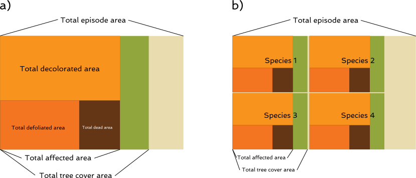

### Introduction

DEBOSCAT App was born from the DEBOSCAT project (Catalonian Forest Condition Monitoring), drived since 2012[^1]
by the catalonian Forest Ecosystem and Environment Management General Bureau. The app offers yearly data about
forest decay episodes registered in Catalonia related to drought. The monitoring along the years allows to
know which areas and which species are most vulnerabe to global change, as well as to know which are the main
triggers of afectations and the recovery capacity of the trees.

### Methodology

Data has been retrieved every year since 2012 until the present, always in September, just after the dry
season. Catalonian Rural Agents Corp (CAR) are the responsible of carrying out the field campaign, allowing
working in a local scale. Agents perform an exhaustive survey in their forests and enter the data in an online
app. Methodlogy consists on detect, delimit and record the tree areas (excluding shrub areas) affected by
decay. A zone is considered affected when it has a size of at least **3 hectares**[^2], where at least one species
present some symptom of decay. To do that, an episode is registered if the mortality rate is at least 5% or
defoliation rate (leaves loss respect to a healthy tree) and/or decoloration rate (no green leaves) is at
least 50%. Affected areas are delimited in a map following topographic homogeneity, vegetation composition,
observed affectations and episode causes.  
Other species with lower levels of affectation are also recorded, but healthy species, even if present, are
not showed.

### Cicatrizations

The follow up of recorded episodes is done for 3 consecutive years. If during this period the episode
affectation does not change or decreases, then the episode is considered cicatrizated and no more follow ups
are necessary. If after some years the area has a relapse, the record is reopen with the same code
(preferably). This way, some episodes can disappear and reappear in different years.

### Data organization and variables

#### Counties explorer

In the counties explorer, data is aggregated by county, allowing queries for all episodes, new episodes
(episodes that appear for the first time in the selected year) and old episodes (episodes that were already
present in previous years to the one selected). Data can also be broken down by species.

  > When summarising by counties, data has to be normalized by the cover of each species and calculated
  against the original episode area (as species can share the same episode). This means that
  if all the values for each county and species (when species break down is active) are summed, the values
  will not be the same as the summary only for counties.

Independently of the type of data selected, the following variables are available:

1. Number of episodes [count]: Episodes recorded the year selected for each county (and species if the broken
  down is selected).

1. Total area of the episodes [ha]: Sum of the area of the episodes delimited by the Rural Agents for each
  county (and species if the broken down is selected).

1. Total tree cover area [ha]: Sum of the area covered by the affected species in the episodes for each county
  (and species if the broken down is selected).

1. Total area affected [ha]: Sum of the affected area in the episodes for each county (and species if the
  broken down is selected).

1. Total area decolorated [ha]: Sum of the decolorated area in the episodes for each county (and species if
  the broken down is selected). Only available from 2014 to present.
  
1. Total area defoliated [ha]: Sum of the defoliated area in the episodes for each county (and species if the
  broken down is selected). Only available from 2014 to present.
  
1. Total area dead [ha]: Sum of the dead area in the episodes for each county (and species if the broken down
  is selected). Only available from 2014 to present.

A visual representation of the variables is found below, a) without species break down, b) with species
breakdown:

#### Episodes explorer

In the case of the episode explorer, individual data for each episode, year and species combination is offered.
The following variables are available:

1. Episode ID: Unique identity of each episode.

1. Year: Year.

1. Species: Species name.

1. county: County name.

1. County ID: Unique numeric county identity.

1. Cover [%]: Percentage of episode covered by the species.

1. Affected trees [%]: Percentage of trees affected.

1. Mortality [%]: Percentage of dead trees.

1. Defoliation [%]: Percentage of defoliated trees.

1. Decoloration [%]: Percentage of decolorated trees.

1. Episode area [ha]: Total area of the episode.

1. New episode [logical]: True if the episode is new in that year, False if the episode already existed.

1. Affected trees distribution [text]: Description of the tree distribution in the affected area.

1. General episode affectation [%]: General affectation of the episode, calculated as:  
  $$
  \frac{\sum_{sp=1}^{sp} (cover_{sp}*affectation_{sp})}{\sum_{sp=1}^{sp} cover_{sp}}
  $$

[^1]: First campaigns were performed in 2010 and 2011, and they were used to test and improve the methodology.

[^2]: For the year 2021 and episode 40-019 this limitation has been ignored.
